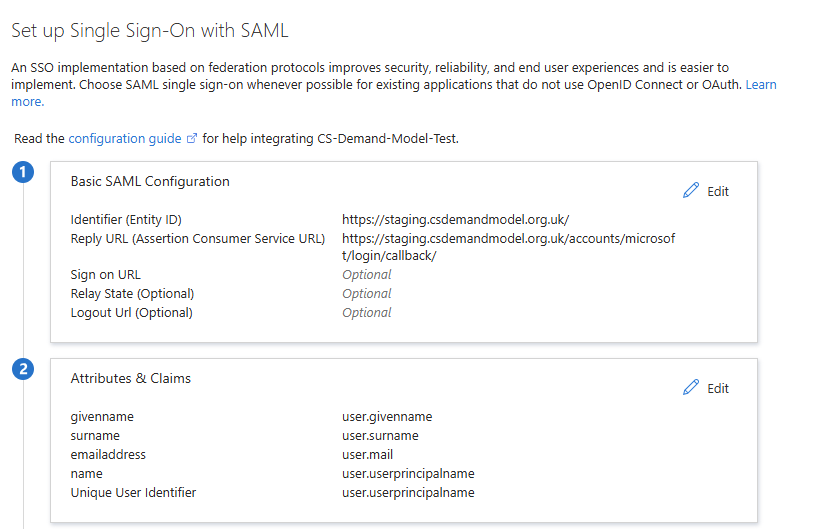
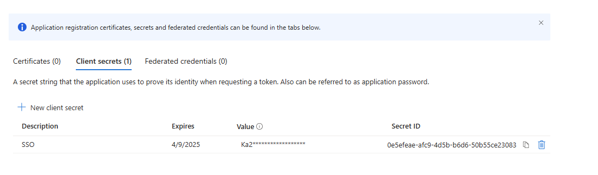
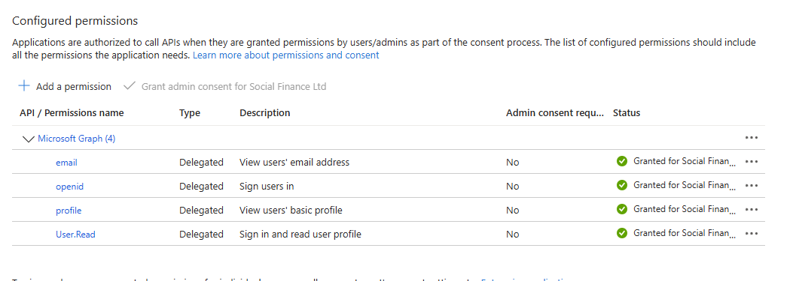

# SSO
## How to Configure
SSO is currently set up to use Azure. In order to configure a new SSO provider, you will need
to create an app registration, an associated enterprise application, and a secret within the
app registration.

1. Within the Azure Portal, create an Enterprise Application (choose "Non-Gallery")
2. Go to "Single sign-on" and choose SAML
3. Complete the Identifier and Reply URL with site URL and the microsoft login callback endpoint respectively
and ensure the Attributes and Claims are listed as below

4. Navigate to the related application registration (Properties -> application registration)
5. Create a client secret and record the value

6. Navigate to API permissions and set the permissions as shown

7. Store the application ID (found in App Registration -> Properties) and secret value as the environment 
variables `MICROSOFT_CLIENT_ID` and `MICROSOFT_CLIENT_SECRET` respectively