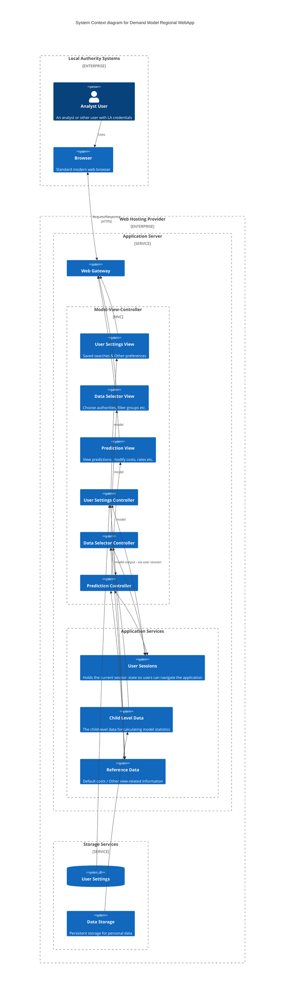

# Regional Demand-model WebApp Architecture

```mermaid

C4Context
title System Context diagram for Demand Model Regional WebApp
Enterprise_Boundary(ent_la, "Local Authority Systems") {
    Person(user, "Analyst User", "An analyst or other user with LA credentials")
    System(browser, "Browser", "Standard modern web browser")

    Rel(user, browser, "Uses")
}
Enterprise_Boundary(webhost, "Web Hosting Provider") {
    Boundary("appserver", "Application Server", "SERVICE") {
        System(webgateway, "Web Gateway")

        BiRel(browser, webgateway, "Request/Response", "HTTPS")

        Boundary("mvc", "Model-View-Controller", "MVC") {
            System(view_settings, "User Settings View", "Saved searches & Other preferences")
            System(view_data, "Data Selector View", "Choose authorities, filter groups etc.")
            System(view_prediction, "Prediction View", "View predictions, modify costs, rates etc.")

            Rel(view_data, webgateway, "")
            Rel(view_settings, webgateway, "")
            Rel(view_prediction, webgateway, "")

            System(controller_settings, "User Settings Controller")
            System(controller_data, "Data Selector Controller")
            System(controller_prediction, "Prediction Controller")

            Rel(controller_data, view_data, "model")
            Rel(controller_settings, view_settings, "model")
            Rel(controller_prediction, view_prediction, "model")

            Rel(controller_data, controller_prediction, "model output - via user session")
        }

        Boundary("app_services", "Application Services", "") {
            System(session_manager, "User Sessions", "Holds the current session state so users can navigate the application")
            System(child_level_data, "Child Level Data", "The child-level data for calculating model statistics")
            System(reference_data, "Reference Data", "Default costs / Other view-related information")

            BiRel(session_manager, controller_settings, "")
            BiRel(session_manager, controller_data, "")
            BiRel(session_manager, controller_prediction, "")

            Rel(child_level_data, controller_data, "")

            BiRel(reference_data, controller_settings, "")
            BiRel(reference_data, controller_data, "")
            BiRel(reference_data, controller_prediction, "")
        }

    }

    Boundary("storage", "Storage Services", "SERVICE") {
        SystemDb(settings_storage, "User Settings", "")
        System(data_storage, "Data Storage", "Persistent storage for personal data")

        Rel(settings_storage, controller_settings, "")
        Rel(data_storage, child_level_data, "")

    }

}

UpdateLayoutConfig($c4ShapeInRow="3", $c4BoundaryInRow="1")


```