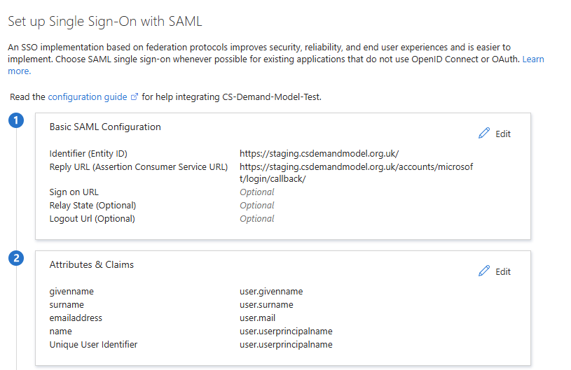

# Authentication
This application supports Single Sign-On (SSO) alongside traditional username/password with MFA.

## SSO
### How to Configure
SSO is currently set up to use Azure. In order to configure a new SSO provider, you will need
to create an app registration, an associated enterprise application, and a secret within the
app registration.

1. Within the Azure Portal, create an Enterprise Application (choose "Non-Gallery")
2. Go to "Single sign-on" and choose SAML
3. Complete the Identifier and Reply URL with site URL and the microsoft login callback endpoint respectively
and ensure the Attributes and Claims are listed as below

4. Navigate to the related application registration (Properties -> application registration)
5. Create a client secret and record the value

6. Navigate to API permissions and set the permissions as shown

7. Set environment variables as such:
```shell
MICROSOFT_TENANT_ID = the directory (tenant) ID (found in App Registration -> Properties)
MICROSOFT_CLIENT_ID = the application ID (found in App Registration -> Properties)
MICROSOFT_CLIENT_SECRET = the secret value from step 5
```

## Username/Password with MFA
The application uses `django-allauth` for authentication, which supports MFA. The current authentication standards
include:
- Minimum password length of 12 characters (this is configurable)
- MFA using TOTP apps - MFA must be enabled for users to access the application
- Email verification upon first login

### Account Recovery
If a user needs to reset their password, they can use the "Forgot Password" link on the login page.

If a user is locked out due to MFA issues, an admin can reset their MFA settings via the Django admin interface.
We recommend that the MFA recovery process includes identity verification steps to ensure security - in particular,
due to the small number of users, we recommend using a video call where the user is verified either
through presentation of identification or through a trusted individual (e.g. their manager).